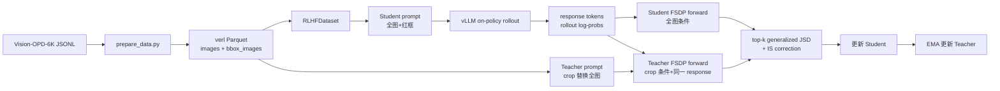

# Vision-OPD：OPSD 在多模态任务中的实现分析

> 分析对象：`../Vision-OPD-main`  
> 分析重点：数据、模型、训练策略  
> 说明：本文以仓库当前源码、启动脚本和本地 Hydra 配置为准。仓库没有 `.git` 历史，因此无法精确还原它相对某个 verl 上游 commit 的完整 diff。

## 1. 核心结论

Vision-OPD 并不是在标准 PPO/GRPO 上增加一个视觉奖励函数，而是复用 verl 的数据加载、Ray 调度、vLLM rollout、FSDP 训练和 checkpoint 基础设施，将 actor 的策略梯度更新替换为一种 **区域到全图的 on-policy self-distillation**：

1. **Student** 观察带红框的全图，按部署时的正常视觉输入方式生成 response。
2. **Teacher** 使用同架构模型，但观察证据区域的 crop 图；teacher 不生成另一条 response，只对 student 已生成的同一串 response token 计算 next-token 分布。
3. 训练让全图 student 的 token 分布逼近区域 teacher 的 token 分布。
4. 默认配置不使用 reward model、ground-truth reward、critic 或 GRPO advantage；主要监督信号是 top-k generalized JSD。
5. Teacher 不是外部更大模型，而是 actor 初始参考副本，并以 EMA 方式跟随 student。

因此，多模态 OPSD 的关键不是“蒸馏一个外部 VLM”，而是：

> **同一个 MLLM、同一条 on-policy response、两种视觉条件：crop 特权视图教 full-image 标准视图。**

项目文档也直接将方法描述为 crop-conditioned teacher 与 full-image-conditioned student，并说明 student 生成 on-policy rollout、优化二者沿 rollout 的 token-level 分布差异（`../Vision-OPD-main/data/README.md:20-29`）。

## 2. 术语辨析

仓库中的命名容易造成误解：

- **Vision-OPD / OPD**：论文和项目层面的名称，指 regional-to-global on-policy self-distillation。
- **`loss_mode=vopd`**：代码中真正启用自蒸馏 actor update 的开关。
- **`vopd.yaml`**：Vision-OPD 启动脚本实际使用的 Hydra 配置。
- **`opsd.yaml` / `teacher_prompt_mode=answer_hint`**：仓库中的另一种文本答案提示模式，不是当前 `run_vision_opd.sh` 使用的区域图像蒸馏路径。
- 源码部分注释把 image-swap 路径称为 teacher SDPO，但从项目方法语义看，它就是 Vision-OPD 的主要实现。

本文所说“OPSD 应用于多模态任务”，特指项目实际运行的：

```text
loss_mode=vopd
+ teacher_always_on=True
+ teacher_image_key=bbox_images
+ teacher_prompt_mode=null
```

而不是 answer-hint 文本蒸馏。

## 3. 总体架构



完整调用链为：

```text
scripts/run_vision_opd.sh
  -> python -m verl.trainer.main_ppo --config-name vopd
  -> TaskRunner.run()
  -> RayPPOTrainer.fit()
  -> vLLM generate_sequences()
  -> _maybe_build_self_distillation_batch()
  -> DataParallelPPOActor.update_policy()
  -> compute_self_distillation_loss()
  -> optimizer step
  -> EMA teacher update
```

---

## 4. 数据角度

### 4.1 数据集如何构造“特权视觉条件”

Vision-OPD-6K 共 6,241 条细粒度 VQA 样本。每条记录同时提供：

- `images`：带红色 bounding box overlay 的全图，作为 student 输入；
- `teacher_images`：以证据区域为中心的 crop，作为 teacher 输入；
- `original_images`：不带红框的原图；
- `bbox`：原图上的 `[x1, y1, x2, y2]`；
- `problem`：含 `<image>` 占位符的问题；
- `answer`：ground truth；
- `extra_info`：额外的问题和答案信息。

证据见 `../Vision-OPD-main/data/README.md:31-36,61-73`。

这里有一个重要设计：student 并非完全不知道目标区域，它看到的是“全图 + 红框”；teacher 则直接看到区域 crop。二者的差别主要在视觉分辨率和干扰背景，而不是是否知道关注区域。

这使训练目标成为：

- teacher 在 crop 中更容易识别细粒度对象；
- student 学习在保留全局输入形式的情况下复现 teacher 的局部感知能力；
- 推理时不再需要裁剪工具或额外 teacher。

### 4.2 JSONL 到 verl Parquet

`scripts/prepare_data.py` 将原始字段映射成 verl 可消费的 Parquet：

```python
{
    "prompt": [{"role": "user", "content": item["problem"]}],
    "images": [{"path": image_path}],
    "bbox_images": [{"path": teacher_path}],
    "reward_model": {
        "style": "none",
        "ground_truth": item.get("answer", ""),
    },
    "extra_info": {...},
}
```

关键映射位于 `../Vision-OPD-main/scripts/prepare_data.py:68-90`：

- 原始 `images[0]` 进入 `images`；
- 原始 `teacher_images[0]` 被重命名为 `bbox_images`；
- `original_images` 和 `bbox` 没有进入训练 Parquet；
- 原始 `problem` 原样进入 prompt；
- 清除 `<image>` 和 bbox 提示后的 question 只放在 `extra_info` 中。

`answer` 虽被保存到 `reward_model.ground_truth` 和 `extra_info.answer`，但主训练路径不会用它计算 reward 或 loss。保存这些字段主要是兼容 verl schema、日志记录和其他可选训练模式。

### 4.3 Dataset 与多模态消息

项目沿用 verl 的 `RLHFDataset`，没有另写 Vision-OPD Dataset。

`RLHFDataset._build_messages()` 会：

1. 从记录中取出并 `pop` 掉 `images`；
2. 将 prompt 中的 `<image>` 替换成结构化内容：

   ```python
   {"type": "image", "image": image_path}
   ```

3. 将普通文本转换成 `{"type": "text", "text": ...}`；
4. 最终把结果写入 `raw_prompt`。

证据见 `../Vision-OPD-main/verl/utils/dataset/rl_dataset.py:286-350`。

这一行为意味着：

- student 图像随 `raw_prompt` 进入 rollout pipeline；
- `images` 原字段被消费掉；
- `bbox_images` 不属于 dataset 的默认 `image_key`，因此保留在 `non_tensor_batch` 中，供训练阶段单独构造 teacher 输入。

这正是同一个 batch 中维持两套视觉条件的关键。

### 4.4 Prompt、processor 与 chat template

启动脚本指定 Qwen3.5 自定义模板：

```text
chat_templates/perception_chat_template_qwen35.jinja
```

`main_ppo.py` 将模板同时注入 tokenizer 和 processor（`../Vision-OPD-main/verl/trainer/main_ppo.py:325-335`）。随后 rollout agent 使用 processor 完成：

- chat template 展开；
- 图像预处理；
- 视觉 token 插入；
- `input_ids`、多模态 tensor 和位置编码构造。

Teacher 不是简单复用 student 的 tokenized prompt，因为 crop 图可能产生不同数量的视觉 token。trainer 会用 crop 图重新运行 processor，并重新计算 Qwen-VL/Qwen3.5 所需的多模态位置编码，然后把 student response token 拼接在 teacher prompt 后。

### 4.5 Teacher 图像替换

在 `teacher_always_on=True` 时，trainer 从 batch 的 `bbox_images` 读取 crop：

1. 检查每个样本是否有 teacher 图；
2. 用 crop 替换 `raw_prompt` 中的 student 图像；
3. 文本 prompt 保持不变；
4. 对 teacher prompt 单独做 processor 编码；
5. 拼接 student rollout 的同一 response；
6. 生成：
   - `teacher_input_ids`
   - `teacher_attention_mask`
   - `teacher_position_ids`
   - `teacher_response_start_idx`
   - `teacher_multi_modal_inputs`
   - `self_distillation_mask`

证据见 `../Vision-OPD-main/verl/trainer/ppo/ray_trainer.py:1279-1390`。

如果 crop 缺失且 `fallback_to_policy_loss_on_missing_teacher=False`，训练会直接报错，而不是静默退回普通 GRPO（同文件 `1310-1318`）。

### 4.6 数据流总结

```text
原始 JSONL
  images             -> Parquet images
  teacher_images     -> Parquet bbox_images
  answer             -> 仅保留，主 loss 不消费

RLHFDataset
  images             -> 嵌入 raw_prompt -> student rollout
  bbox_images        -> 保留在 non_tensor_batch

RayPPOTrainer
  raw_prompt         -> 全图 student 输入
  bbox_images        -> 替换图像后形成 teacher 输入
  student responses  -> 同时接到 student/teacher prompt 后
```

---

## 5. 模型角度

### 5.1 Student、Rollout、Teacher、Reference 的关系

默认配置下各角色如下：

| 角色 | 权重/实现 | 输入 | 是否生成 token | 是否训练 |
|---|---|---|---|---|
| Student / Actor | Qwen3.5-4B FSDP actor | 全图+红框 | 否，训练时评估已有 response | 是 |
| Rollout policy | 与 actor 同步的 vLLM engine | 全图+红框 | 是 | 否 |
| Teacher | reference FSDP 副本 | crop 图 | 否，只评估同一 response | EMA 更新 |
| Reference policy | 与 teacher 共用模块 | 不用于标准 KL | 否 | 否 |
| Critic | 默认不创建 | — | — | — |
| Reward model | 显式关闭 | — | — | — |

Teacher 模块的绑定发生在 `../Vision-OPD-main/verl/workers/fsdp_workers.py:896-931`。当：

```text
loss_mode == vopd
teacher_model_source == legacy
teacher_regularization == ema
```

时，`actor.teacher_module = ref_module_fsdp`。

因此项目所说“不使用外部 teacher”是准确的：teacher 是同一个 base MLLM 的滞后副本，而不是另一个大型 VLM。

### 5.2 多模态条件是如何进入模型的

Student 和 teacher 共用相同 VLM 架构。差异通过 `multi_modal_inputs` 进入模型 forward：

- student 的 `multi_modal_inputs` 来自全图；
- teacher 的 `teacher_multi_modal_inputs` 来自 crop；
- 两者使用各自的 prompt token、视觉 token、attention mask 和 position ids；
- response token 本身相同，因此可以逐 token 比较 next-token 分布。

Actor 更新中 teacher 在 `torch.no_grad()` 下执行，证据见：

`../Vision-OPD-main/verl/workers/actor/dp_actor.py:1012-1042`。

这可以写成两种条件策略：

$$
\pi_\theta(\cdot \mid x_{\text{full}}, y_{<t})
$$

与

$$
\pi_{\bar\theta}(\cdot \mid x_{\text{crop}}, y_{<t})
$$

其中：

- $x_{\text{full}}$ 是全图+红框；
- $x_{\text{crop}}$ 是证据 crop；
- $y$ 是 student 在全图条件下采样的 response；
- $\theta$ 是 student 参数；
- $\bar\theta$ 是 EMA teacher 参数。

### 5.3 Teacher 不生成另一条轨迹

这是方法中最重要的 on-policy 属性之一。

Rollout 阶段只有 student/vLLM 在全图条件下采样：

$$
y \sim \pi_{\text{rollout}}(\cdot \mid x_{\text{full}})
$$

Teacher 随后仅计算：

$$
\log \pi_{\bar\theta}(y_t \mid x_{\text{crop}}, y_{<t})
$$

它不会在 crop 条件下重新生成 $y'$。这样避免了两个视觉条件生成不同文本后难以做逐 token 对齐的问题，也保证蒸馏发生在 student 当前实际访问的 response 分布上。

### 5.4 EMA Teacher

每次有效 actor optimizer step 后，teacher 采用：

$$
\bar\theta \leftarrow (1-\beta)\bar\theta+\beta\theta
$$

默认 $\beta=0.05$，见：

- `../Vision-OPD-main/scripts/run_vision_opd.sh:17-19`
- `../Vision-OPD-main/verl/workers/actor/dp_actor.py:134-155`

EMA 的作用是：

- 让 teacher 保持相对稳定，避免 student 和 teacher 同步变化造成目标漂移；
- 同时允许 teacher 随 student 能力提高；
- crop 条件提供更容易的视觉任务，使同架构 teacher 仍能输出更有信息量的 token 分布。

### 5.5 为什么 crop teacher 能改善全图感知

从代码机制可做如下解释：

1. crop 提高目标区域的有效视觉分辨率；
2. crop 减少无关背景和全图视觉 token 的干扰；
3. teacher 在相同语言前缀下更容易对关键实体、属性和答案 token 给出尖锐或正确的概率分布；
4. JSD 将这些分布信息传给全图 student；
5. student 最终仍以标准全图形式运行，因此训练收益不依赖推理时 crop。

需要注意：仓库只能证明“分布被匹配”，不能仅从源码证明所有 benchmark 提升都由上述单一机制导致。

---

## 6. 训练策略角度

### 6.1 实际训练配置

当前 `scripts/run_vision_opd.sh` 的核心配置为：

| 配置 | 值 |
|---|---|
| Base model | `Qwen/Qwen3.5-4B` |
| Train batch size | 96 |
| Rollout `n` | 8 |
| PPO mini-batch size | 96 |
| Learning rate | `2e-6` |
| Epoch | 1 |
| Max prompt / response | 8192 / 1024 |
| Loss mode | `vopd` |
| Teacher | legacy ref + EMA |
| EMA update rate | 0.05 |
| Distillation top-k | 100 |
| JSD alpha | 0.5 |
| Distillation IS cap | 2.0 |
| Rollout correction | token IS，阈值 2.0 |
| Advantage estimator | 配置为 GRPO，但主路径跳过 |
| Reward model | 关闭 |
| KL-to-reference | 关闭 |
| GPU | 8 / node |
| FSDP offload | actor param、optimizer、ref param |

证据见 `../Vision-OPD-main/scripts/run_vision_opd.sh:14-48,87-164`。

### 6.2 每个训练 step 的时序

`RayPPOTrainer.fit()` 的实际时序如下：

1. DataLoader 读取 96 个 prompt；
2. 为每个 prompt 分配 `uid`；
3. 每个 prompt 重复 `rollout.n=8` 次；
4. vLLM 使用全图 student 条件生成 response 和 `rollout_log_probs`；
5. 原始 batch 同样 repeat 8 次，并与 rollout 输出合并；
6. reward-free 分支构造全零 reward tensor；
7. 复用或重算 `old_log_probs`；
8. 用 `bbox_images` 构建 teacher batch；
9. 计算 rollout correction 的 token-level IS weight；
10. 当所有样本均有 teacher 时跳过 GRPO advantage；
11. actor worker 分别做 student forward 与 teacher no-grad forward；
12. 计算 self-distillation loss；
13. 反向传播，仅更新 student；
14. optimizer step 后用 student EMA 更新 teacher；
15. 写入 rollout 日志，按配置决定是否保存 checkpoint。

训练主循环证据见 `../Vision-OPD-main/verl/trainer/ppo/ray_trainer.py:2328-2587`。

### 6.3 Reward-free 与跳过 Advantage

当以下条件同时成立：

```text
loss_mode == vopd
teacher_always_on == True
teacher_image_key != None
fallback_to_policy_loss_on_missing_teacher == False
```

`main_ppo.py` 将 `reward_fn` 设为 `None`（`../Vision-OPD-main/verl/trainer/main_ppo.py:337-346`）。

训练循环随后：

- 创建全零 `reward_tensor`（`ray_trainer.py:2426-2429`）；
- 不计算 reward/KL reward；
- 若 `self_distillation_mask` 全为 1，则跳过 `compute_advantage()`（`ray_trainer.py:2553-2573`）。

所以 `algorithm.adv_estimator=grpo` 并不表示主路径真的执行 GRPO 更新。这里的 GRPO 配置主要用于：

- 不创建 critic；
- 保持 verl 配置兼容；
- 在可选 fallback 模式下处理没有 teacher 图的样本。

默认数据完整且 fallback 关闭时，实际是纯蒸馏训练。

### 6.4 蒸馏损失

默认开启 full-logit distillation，但为节省显存与计算只取 top-100，并增加一个 tail bucket：

```text
student top-k log-probs
teacher 在相同 student top-k token 上的 log-probs
+ vocabulary tail probability bucket
```

实现位于 `../Vision-OPD-main/verl/trainer/ppo/core_algos.py:1085-1210`。

设：

$$
p_t(v)=\pi_\theta(v\mid x_{\text{full}},y_{<t})
$$

$$
q_t(v)=\pi_{\bar\theta}(v\mid x_{\text{crop}},y_{<t})
$$

混合分布为：

$$
m_t=(1-\alpha)p_t+\alpha q_t
$$

代码在 $0<\alpha<1$ 时计算 generalized Jensen-Shannon divergence：

$$
\mathcal L^{\text{JSD}}_t
=(1-\alpha)\operatorname{KL}(p_t\|m_t)
+\alpha\operatorname{KL}(q_t\|m_t)
$$

默认 $\alpha=0.5$，即对称 JSD。对应实现为：

- mixture：`core_algos.py:1150-1160`
- 两侧 KL 与插值：`core_algos.py:1161-1165`

最后按有效 response token 做 `token-mean` 聚合。

### 6.5 两层重要性采样校正

项目同时存在两类 IS：

#### 6.5.1 Distillation IS

actor update 内部用当前 student 与 old policy 的 token log-prob 差：

$$
r_t=
\min\left(
\exp\left[
\log\pi_\theta(y_t)-\log\pi_{\text{old}}(y_t)
\right],
c_{\text{distill}}
\right)
$$

默认 $c_{\text{distill}}=2.0$。实现见 `core_algos.py:1173-1181`。

#### 6.5.2 Rollout correction IS

vLLM rollout 和 FSDP actor 即使权重同步，也可能因为推理后端、精度或更新时序产生 log-prob 差异。trainer 因此计算 token-level rollout correction weight，并在 loss 中再次相乘：

$$
\tilde{\mathcal L}_t
=
w_t^{\text{rollout}}
r_t
\mathcal L_t^{\text{JSD}}
$$

`rollout_is_weights` 应用位置见 `core_algos.py:1183-1185`，driver 侧构造位置见 `ray_trainer.py:2538-2551`。

这两层 IS 的用途不同：

- distillation IS 约束当前更新相对 old policy 的偏移；
- rollout IS 修正 vLLM rollout policy 与训练端 old policy 的差异。

### 6.6 Actor update 如何替代 PPO loss

在 `loss_mode=vopd` 时，actor 不通过 policy-loss registry 选择普通 PPO loss，而是在 `update_policy()` 中直接执行：

1. student forward；
2. teacher no-grad forward；
3. `compute_self_distillation_loss()`；
4. `pg_loss = vopd_loss`；
5. backward 和 optimizer step。

证据见 `../Vision-OPD-main/verl/workers/actor/dp_actor.py:1012-1113`。

只有当部分样本缺 teacher 且启用 fallback 时，代码才为这些样本额外计算 vanilla/GRPO policy loss，并令：

$$
\mathcal L=\mathcal L_{\text{VOPD}}+\mathcal L_{\text{GRPO-fallback}}
$$

默认 Vision-OPD 配置不进入该分支。

### 6.7 KL、PPO clip 和 critic

主路径中：

- `actor.use_kl_loss=False`；
- `algorithm.use_kl_in_reward=False`；
- reward model 关闭；
- critic 不需要；
- PPO `clip_ratio_high/low` 不作用于 VOPD 主 loss；
- ref 模块主要作为 teacher 容器，而不是计算标准 reference KL。

所以不能把 VOPD loss 理解为“PPO loss + 一项视觉蒸馏正则”。准确说法是：

> **在 verl/PPO 训练外壳内，以自蒸馏 loss 取代主策略梯度 loss。**

### 6.8 分布式与显存策略

项目保留 verl 的 hybrid actor-rollout 架构：

- Ray 负责 worker 编排；
- actor、rollout、ref/teacher colocate；
- actor 使用 FSDP；
- rollout 使用 vLLM；
- 开启 remove padding 与 gradient checkpointing；
- 使用 dynamic batch，按 token 数控制 micro-batch；
- actor 参数、optimizer 和 ref 参数启用 offload；
- vLLM GPU memory utilization 为 0.7；
- 8 GPU/node，rollout TP=1。

这套配置的目的，是在 8192 prompt + 1024 response 的多模态长序列下同时容纳：

- student forward/backward；
- teacher no-grad forward；
- vLLM KV cache；
- student/teacher top-k token distribution。

---

## 7. 与标准 PPO/GRPO 的差异

| 维度 | 标准 verl PPO/GRPO | Vision-OPD |
|---|---|---|
| 轨迹来源 | policy rollout | 全图 student rollout |
| 学习信号 | reward + advantage | crop teacher 与 full-image student 的 token 分布差异 |
| Actor loss | clipped policy gradient | top-k generalized JSD |
| Critic | PPO/GAE 常需要；GRPO 不需要 | 不创建 |
| Reward model/verifier | 常用 | 默认完全关闭 |
| Ground truth | 可进入 reward | 数据中保留，但主 loss 不使用 |
| Reference model | 常用于 KL | 主要作为 EMA teacher |
| Teacher | 通常没有 | 同架构 crop-conditioned EMA teacher |
| 多模态变化 | 通常只改变 policy 输入 | 同一 response 上构建两套视觉条件 |
| `rollout.n=8` | 用于 group-relative advantage | 主路径不做 group reward ranking |
| 推理时额外组件 | 视任务而定 | 只保留 full-image student |

---

## 8. OPSD 应用于多模态任务的本质

从数据、模型和训练三个角度可以把方法压缩成以下三层：

### 8.1 数据层：为同一样本提供难/易两种视觉视图

- 难视图：全图+红框，接近真实推理输入；
- 易视图：目标 crop，具有局部高分辨率和低背景干扰；
- 文本问题和 response 保持共享。

### 8.2 模型层：同架构条件策略，而非异构外部 teacher

- student 与 teacher 都是同一 MLLM 架构；
- teacher 是 EMA 权重；
- 差异主要由视觉 conditioning 产生；
- teacher 仅评估，不生成另一条 trajectory。

### 8.3 训练层：在 student 自己访问的 token 上做分布匹配

- response 来自 full-image student 的 on-policy rollout；
- student/teacher 对同一 response 做 teacher forcing；
- 逐 token 匹配 next-token distribution；
- 无需把 QA 正误压缩成一个标量 reward；
- 通过 JSD 保留比 hard answer label 更丰富的类别和语言不确定性信息。

这使 OPSD 从纯语言任务中的“更强提示/更好上下文教普通提示”，自然扩展成多模态任务中的：

> **特权视觉条件教标准视觉条件。**

---

## 9. 风险、限制与值得注意的实现细节

1. **命名混乱**  
   `opsd.yaml` 的 answer-hint 模式不是 `run_vision_opd.sh` 的 Vision-OPD 主路径。阅读代码时应以 `loss_mode=vopd + teacher_image_key=bbox_images` 为准。

2. **“无 ground truth”应准确理解**  
   数据文件含 answer，Parquet 也保留 `ground_truth`；只是 reward-free 主训练路径不消费它。不能说仓库完全没有标签，只能说默认优化目标不依赖标签 reward。

3. **依赖高质量 bbox/crop 数据**  
   虽然推理时不需要 crop，但训练时需要每条样本的证据区域。区域标注成本被转移到数据构造阶段。

4. **Teacher 缺失会硬失败**  
   默认 fallback 关闭；`bbox_images` 为空会报错。

5. **Teacher 与 student 初始能力接近**  
   teacher 的优势主要来自 crop 条件而不是参数规模。若 crop 没有显著降低视觉难度，蒸馏信号可能偏弱。

6. **`rollout.n=8` 的算法必要性有限**  
   主路径跳过 GRPO advantage，因此 8 个 rollout 不用于组内 reward 排序。它仍可增加 response 覆盖，但也显著增加生成成本。

7. **默认训练中不验证**  
   `trainer.test_freq=-1` 且 `val_before_train=False`，质量依赖训练后独立评测。

8. **默认不保存 checkpoint**  
   当前脚本 `TRAINER_SAVE_FREQ=-1`。本地存在 checkpoint 说明某些运行曾通过额外参数覆盖，但直接运行默认脚本可能不保存中间权重。

9. **配置项存在遗留痕迹**  
   `self_distillation.gamma` 在配置中存在，但当前核心 loss 未使用；PPO clip 参数在纯 VOPD 主路径也不起作用。

10. **仓库没有自动化测试证明整条 VOPD 数据链路**  
    数据 schema、teacher image swap 和 reward-free 分支主要靠运行时校验与日志观察。

11. **仓库无 git 历史**  
    可以定位包含 VOPD 逻辑的文件，但不能严格断言每一处都是相对某个 verl 版本新增的 patch。

---

## 10. 关键源码索引

| 主题 | 文件与行号 |
|---|---|
| 项目方法定义 | `../Vision-OPD-main/data/README.md:20-29` |
| 数据字段 | `../Vision-OPD-main/data/README.md:31-36,61-73` |
| JSONL 转 Parquet | `../Vision-OPD-main/scripts/prepare_data.py:68-109` |
| 训练超参数与入口 | `../Vision-OPD-main/scripts/run_vision_opd.sh:14-48,87-164` |
| 多模态 Dataset | `../Vision-OPD-main/verl/utils/dataset/rl_dataset.py:286-367` |
| Processor/chat template 初始化 | `../Vision-OPD-main/verl/trainer/main_ppo.py:325-335` |
| Reward-free reward_fn | `../Vision-OPD-main/verl/trainer/main_ppo.py:337-346` |
| Teacher crop batch | `../Vision-OPD-main/verl/trainer/ppo/ray_trainer.py:1279-1390` |
| 训练主循环 | `../Vision-OPD-main/verl/trainer/ppo/ray_trainer.py:2328-2587` |
| Reward/advantage 跳过 | `../Vision-OPD-main/verl/trainer/ppo/ray_trainer.py:2426-2429,2524-2573` |
| JSD 与 IS loss | `../Vision-OPD-main/verl/trainer/ppo/core_algos.py:1085-1210` |
| Student/teacher forward 与 actor loss | `../Vision-OPD-main/verl/workers/actor/dp_actor.py:990-1113` |
| EMA teacher 更新 | `../Vision-OPD-main/verl/workers/actor/dp_actor.py:134-175,1203-1209` |
| Teacher/ref 模块绑定 | `../Vision-OPD-main/verl/workers/fsdp_workers.py:896-931` |

## 11. 最终总结

Vision-OPD 将 OPSD 应用于多模态任务的方式可以概括为：

> 先让 full-image student 在当前策略下生成 on-policy response，再用同一 MLLM 的 crop-conditioned EMA teacher 对这条 response 提供逐 token 概率分布，最后通过 top-k generalized JSD 和重要性采样校正，把区域特权感知蒸馏回全图策略。

它的创新点不在于新的视觉 backbone 或 reward model，而在于将 **privileged visual view** 嵌入 verl 的 on-policy 训练循环，并解决：

- student/teacher 多模态输入不同；
- 视觉 token 数量和位置编码不同；
- response 必须逐 token 对齐；
- rollout 与训练引擎存在 policy/log-prob 差异；
- teacher 需要稳定但又随 student 更新；
- 最终推理不能依赖 crop 或外部 teacher。

因此，从工程上看，Vision-OPD 是一个“保留 verl 分布式训练外壳、用多模态条件自蒸馏替换 PPO/GRPO 主学习信号”的实现。
